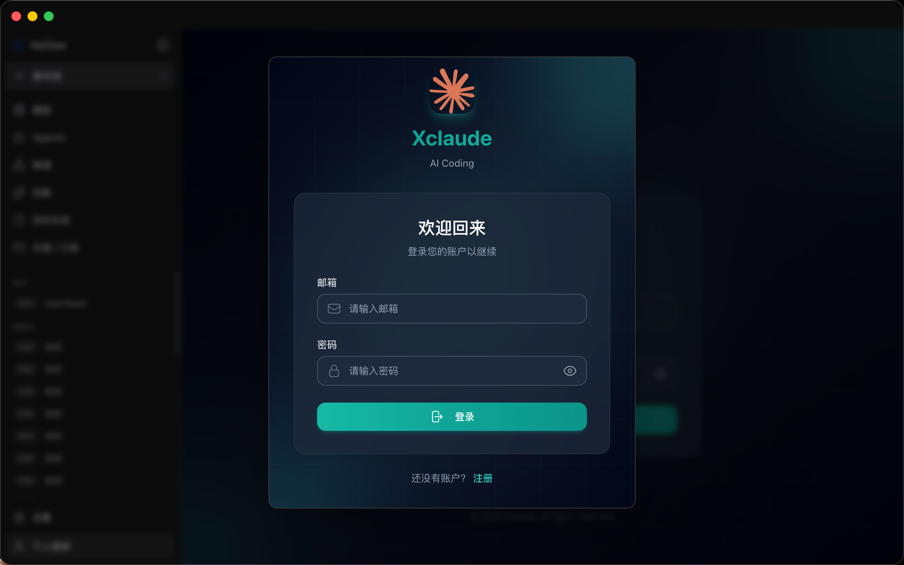
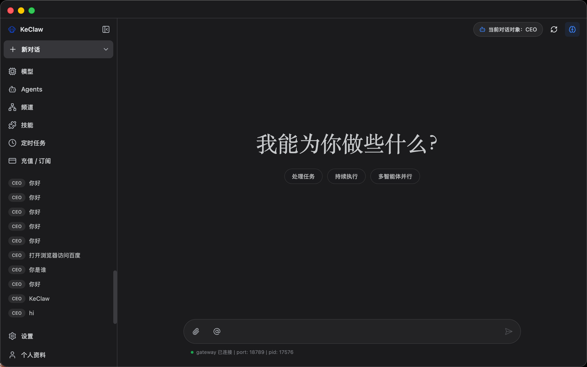
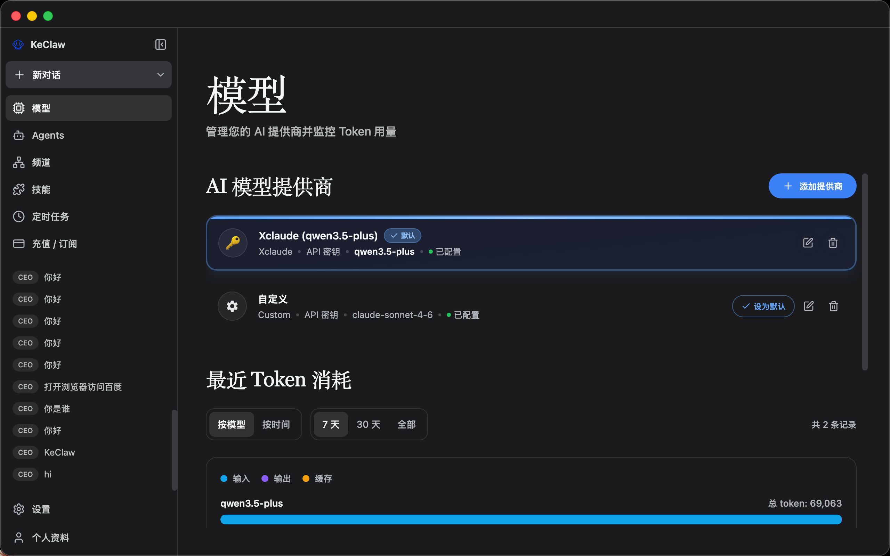
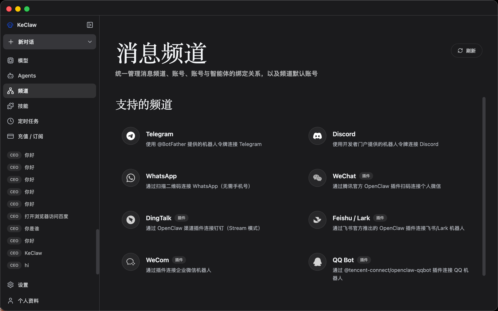
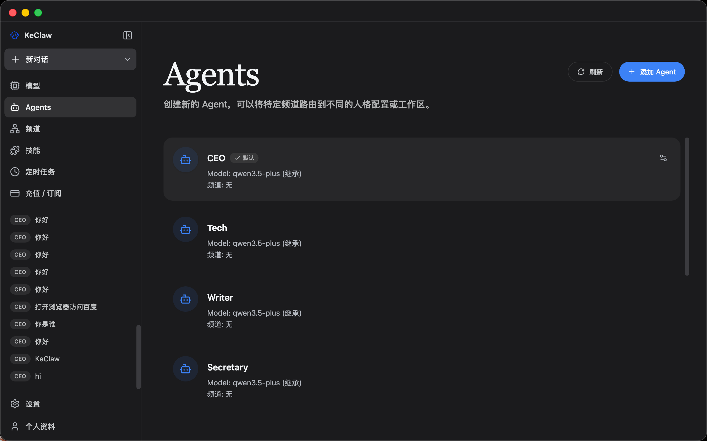
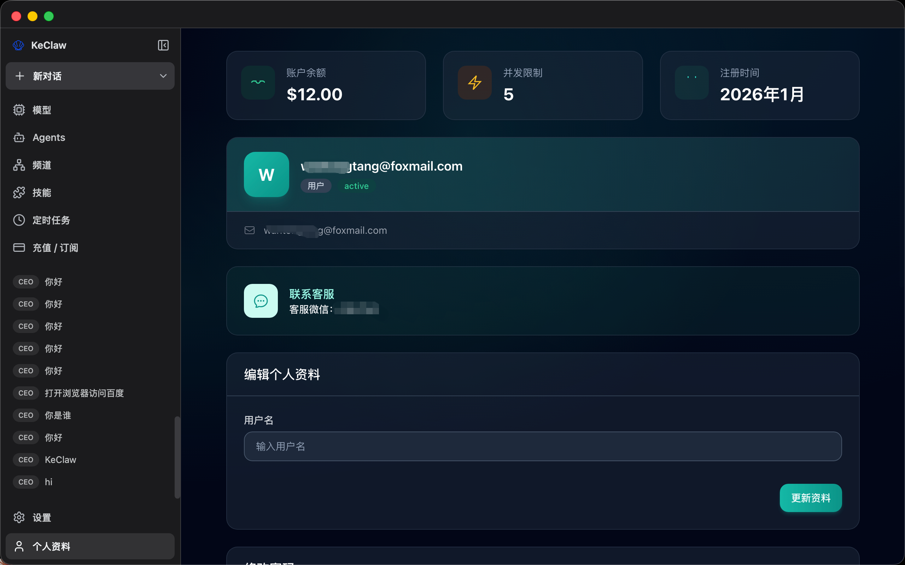
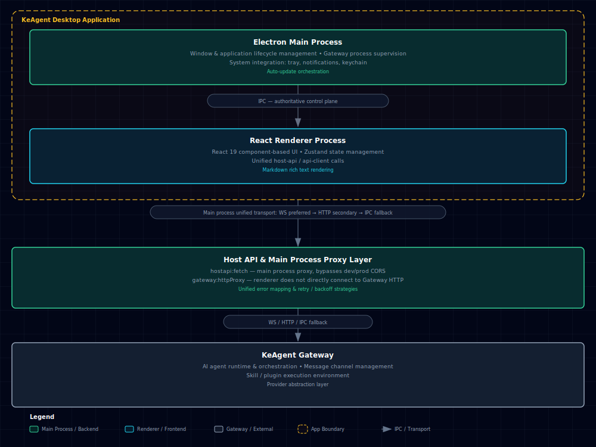

<p align="center">
  
</p>

<h1 align="center">KeAgent</h1>

<p align="center">
  <strong>A Desktop Client for AI Agents</strong>
</p>

<p align="center">
  <a href="#features">Features</a> •
  <a href="#why-keagent">Why KeAgent</a> •
  <a href="#quick-start">Quick Start</a> •
  <a href="#system-architecture">System Architecture</a> •
  <a href="#development-guide">Development Guide</a> •
  <a href="#contributing">Contributing</a> •
  <a href="#todo">TODO</a>
</p>


---

## 📋 Overview

**KeAgent** is a desktop client for AI agents open-sourced by Beike Zhaofang. It bridges powerful AI agents and everyday users, transforming command-line AI orchestration into an easy-to-use, elegant desktop experience—no terminal required.

- 🖥️ **Zero-barrier onboarding** — Full GUI setup, no terminal needed
- 🤖 **Multi-agent management** — Create and switch between agents with isolated workspaces
- 📡 **Multi-channel integration** — Connect Telegram, WeChat, and more; bind each channel to a specific agent
- ⏰ **Scheduled task automation** — Visual cron scheduler with external delivery support, 24/7 agent operation
- 🧩 **Skill marketplace** — Browse, install, and manage extension skills without a package manager
- 🔐 **Secure credential storage** — API keys stored in the OS native keychain; supports OpenAI, Anthropic, and more
- 🌙 **Adaptive theme** — Light / dark mode or follow system preference automatically
- 🌐 **Multi-language & proxy** — Native Windows / macOS support with built-in i18n and proxy settings

---

## 💬 WeChat Community

WeChat ID: **wantongtang** / **Thinkre** (add as friend to be invited to the group)


## 📸 Screenshots

<table>
<tr>
<td align="center">
  
</td>
<td align="center">
  
</td>
</tr>
<tr>
<td align="center">
  
</td>
<td align="center">
  
</td>
</tr>
<tr>
<td align="center">
  
</td>
<td align="center">
  
</td>
</tr>
</table>

---

## 💡 Why KeAgent

Building AI agents shouldn't require mastery of the command line. KeAgent's design philosophy is simple: **powerful technology deserves an interface that respects users' time.**

| Pain Point | KeAgent Solution |
|------------|------------------|
| Complex CLI configuration | One-click installation with guided setup wizard |
| Manual config file editing | Visual settings UI with real-time validation |
| Tedious process management | Automatic gateway lifecycle management |
| Switching between multiple AI providers | Unified provider configuration panel |
| Complex skill/plugin installation | Built-in skill marketplace and management UI |


## ✨ Features

### 🎯 Zero Configuration Barrier
From installation to your first AI conversation, everything is done through an intuitive graphical interface. No terminal commands, no YAML files, no hunting for environment variables.

### 💬 Intelligent Chat Interface
Interact with AI agents through a modern chat experience. Supports multi-session context, message history, Markdown rich text rendering, and direct routing to target agents via `@agent` in the main input box in multi-agent scenarios.
When you use `@agent` to select another agent, KeAgent switches directly to that agent's own conversation context rather than forwarding through the default agent. Each Agent workspace is isolated by default, but stronger runtime isolation can be achieved through sandbox configuration.
Each Agent can also override its own `provider/model` runtime settings; Agents without overrides will continue to inherit the global default model.

### 📡 Multi-Channel Management
Configure and monitor multiple AI channels simultaneously. Each channel runs independently, allowing you to run specialized agents for different tasks.
Each channel now supports multiple accounts, and account binding to Agents and default account switching can be completed directly on the Channels page.
KeAgent now has a built-in Tencent official personal WeChat channel plugin, allowing you to complete WeChat connection directly through the built-in QR code process on the Channels page.

### ⏰ Scheduled Task Automation
Schedule AI tasks for automatic execution. Define triggers, set intervals, and let AI agents work 24/7 without interruption.
The scheduled tasks page now supports external delivery configuration, uniformly split into "sender account" and "recipient target" dropdown selections. For supported channels, recipient targets are automatically discovered from channel directory capabilities or known session history, eliminating the need to manually edit `jobs.json`.
Known limitation: WeChat is currently not in the supported scheduled task delivery channel list. The reason is that the `openclaw-weixin` plugin's outbound sending depends on `contextToken` in real-time sessions, and the plugin itself does not support active push scenarios like cron.

### 🧩 Extensible Skill System
Expand AI agent capabilities through pre-built skills. Browse, install, and manage skills in the integrated skill panel—no package manager required.
KeAgent also comes with complete document processing skills (`pdf`, `xlsx`, `docx`, `pptx`) pre-installed, automatically deployed to the hosted skill directory (default `~/.keagent/skills`) at startup, and enabled by default during initial installation. Additional pre-installed skills (`find-skills`, `self-improving-agent`, `tavily-search`, `brave-web-search`) are also enabled by default; if required API Keys are missing, OpenClaw will provide configuration error prompts at runtime.  
The Skills page displays skills from multiple skill libraries (hosted directory, workspace, additional skill directories) and shows the actual path of each skill, making it easy to directly open the real installation location.

Required environment variables for search skills:
- `BRAVE_SEARCH_API_KEY`: for `brave-web-search`
- `TAVILY_API_KEY`: for `tavily-search` (upstream runtime may also support OAuth)

### 🔐 Secure Provider Integration
Connect multiple AI providers (OpenAI, Anthropic, etc.) with credentials securely stored in the system's native keychain. OpenAI supports both API Key and browser OAuth (Codex subscription) login.
If you connect to an OpenAI-compatible gateway through **Custom Provider**, you can configure a custom `User-Agent` in **Settings → AI Providers → Edit Provider** to improve compatibility.

### 🌙 Adaptive Theme
Supports light mode, dark mode, or following system theme. KeAgent automatically adapts to your preferences.

### 🚀 Auto-Start Control
In **Settings → General**, you can enable **Auto-start on login** to let KeAgent start automatically after system login.

---

## 🚀 Quick Start

### System Requirements

- **Operating System**: macOS 11+, Windows 10+
- **Memory**: Minimum 4GB RAM (8GB recommended)
- **Storage**: 1GB available disk space

### Installation

#### Option 1: Download Installer (Recommended)

Download the latest version installer suitable for your platform from the [Releases](https://github.com/wantt/KeAgent/releases) page:
- **macOS**: `.dmg` file
- **Windows**: `.exe` file

After downloading, follow the installation wizard prompts to complete the installation.

#### Option 2: Build from Source

```bash
# Clone repository
git clone https://github.com/wantt/KeAgent.git
cd KeAgent

# Initialize project
pnpm run init

# Start in development mode
pnpm dev
```

### First Launch

When launching KeAgent for the first time, the **Setup Wizard** will guide you through the following steps:

1. **Language & Region** – Configure your preferred language and region
2. **AI Providers** – Add accounts via API keys or OAuth (browser/device login supported for providers)
3. **Skill Packages** – Select pre-configured skills for common scenarios
4. **Validation** – Test your configuration before entering the main interface

If the system language is in the supported list, the wizard will select it by default; otherwise, it falls back to English.


### Proxy Settings

KeAgent has built-in proxy settings for scenarios requiring access through local proxy clients, including Electron itself, OpenClaw Gateway, and channel networking requests like Telegram.

Open **Settings → Gateway → Proxy** and configure the following:

- **Proxy Server**: Default proxy used for all requests
- **Bypass Rules**: Hosts that need direct connection, separated by semicolons, commas, or newlines
- In **Developer Mode**, you can additionally override:
  - **HTTP Proxy**
  - **HTTPS Proxy**
  - **ALL_PROXY / SOCKS**

Common local proxy example:

```text
Proxy Server: http://127.0.0.1:7890
```
Notes:

- When only filling in `host:port`, it will be treated as an HTTP proxy.
- Advanced proxy items left blank will automatically fall back to "Proxy Server".
- After saving proxy settings, the Electron network layer will immediately reapply the proxy and automatically restart the Gateway.
- When KeAgent proxy is in the closed state, regular Gateway restarts will preserve existing Telegram channel proxy configurations.

---

## 🏗️ System Architecture

KeAgent adopts a **dual-process + Host API unified access architecture**. The renderer process only calls the unified client abstraction, while protocol selection and process lifecycle are uniformly managed by the Electron main process:



### Design Principles

- **Process Isolation**: AI runtime runs in a separate process, ensuring UI remains responsive even during high-load computations
- **Single Frontend Call Entry Point**: Renderer layer uniformly uses host-api/api-client, unaware of underlying protocol details
- **Main Process Controls Transport Strategy**: WS/HTTP selection and IPC fallback are centrally handled in the main process for improved stability
- **Graceful Recovery**: Built-in reconnection, timeout, and backoff logic automatically handles transient failures
- **Secure Storage**: API keys and sensitive data leverage OS-native security storage mechanisms
- **CORS Safety**: Local HTTP requests are proxied by the main process, avoiding renderer cross-origin issues

### Process Model and Gateway Troubleshooting

- KeAgent is based on Electron, and **multiple system processes appearing in a single application instance is normal** (main/renderer/zygote/utility).
- Single-instance protection uses both Electron's built-in lock and local process file lock fallback, which can avoid duplicate launches when desktop session bus is abnormal.
- During rolling upgrades, if old and new versions mix, single-instance protection may still exhibit asymmetric behavior. For stability, it's recommended to uniformly upgrade the desktop client to the same version.
- Use the following commands to confirm listening processes:
  - macOS/Linux: `lsof -nP -iTCP:18800 -sTCP:LISTEN`
  - Windows (PowerShell): `Get-NetTCPConnection -LocalPort 18800 -State Listen`
- Clicking the window close button (`X`) defaults to minimizing to tray and does not fully exit the application. Please select **Quit KeAgent** from the tray menu for a complete exit.

---

## 💼 Use Cases

### 🤖 Personal AI Assistant
Configure a general-purpose AI agent that can answer questions, write emails, summarize documents, and assist with daily tasks—all through a clean desktop interface.

### 📊 Automated Monitoring
Set up scheduled agents to monitor news feeds, track price changes, or listen for specific events. Results are pushed to your preferred notification channels.

### 💻 Developer Productivity Tool
Integrate AI into your development workflow. Use agents for code reviews, generating documentation, or automating repetitive coding tasks.

### 🔄 Workflow Automation
Chain multiple skills together to create complex automation pipelines. Process data, transform content, trigger actions—all orchestrated visually.

---

## 🛠️ Development Guide

### Prerequisites

- **Node.js**: 22+ (LTS version recommended)
- **Package Manager**: pnpm 9+ (recommended) or npm

### Project Structure

```KeAgent/
├── electron/                 # Electron main process
│   ├── api/                 # Main process API routes and handlers
│   │   └── routes/          # RPC/HTTP proxy route modules
│   ├── services/            # Provider, Secrets, and runtime services
│   │   ├── providers/       # Provider/account model sync logic
│   │   └── secrets/         # System keychain and secret storage
│   ├── shared/              # Shared provider schemas/constants
│   │   └── providers/
│   ├── main/                # App entry, windows, IPC registration
│   ├── gateway/             # OpenClaw gateway process management
│   ├── preload/             # Secure IPC bridging
│   └── utils/               # Utility modules (storage, auth, paths)
├── src/                      # React renderer process
│   ├── lib/                 # Frontend unified API and error models
│   ├── stores/              # Zustand state stores (settings/chat/gateway)
│   ├── components/          # Reusable UI components
│   ├── pages/               # Setup/Dashboard/Chat/Channels/Skills/Cron/Settings
│   ├── i18n/                # Internationalization resources
│   └── types/               # TypeScript type definitions
├── tests/
│   └── unit/                # Vitest unit/integration tests
├── resources/                # Static assets (icons, images)
└── scripts/                  # Build and utility scripts
```

### Common Commands

```bash
# Development
pnpm run init             # Install dependencies and download uv
pnpm dev                  # Start in hot-reload mode (automatically prepares pre-installed skill packages if missing)

# Code Quality
pnpm lint                 # Run ESLint check
pnpm typecheck            # TypeScript type checking

# Testing
pnpm test                 # Run unit tests
pnpm run comms:replay     # Calculate communication replay metrics
pnpm run comms:baseline   # Refresh communication baseline snapshot
pnpm run comms:compare    # Compare replay metrics against baseline thresholds

# Build and Package
pnpm run build:vite       # Build frontend only
pnpm build                # Full production build (including packaged resources)
pnpm package              # Package for current platform (including pre-installed skill resources)
pnpm package:mac          # Package for macOS
pnpm package:win          # Package for Windows
pnpm package:linux        # Package for Linux
```

### Communication Regression Check

When PRs involve communication links (Gateway events, Chat send/receive flows, Channel delivery, transport fallback), it's recommended to execute:

```bash
pnpm run comms:replay
pnpm run comms:compare
```

CI's `comms-regression` will validate required scenarios and thresholds.

### Technology Stack

| Layer | Technology |
|-------|------------|
| Runtime | Electron 40+ |
| UI Framework | React 19 + TypeScript |
| Styling | Tailwind CSS + shadcn/ui |
| State Management | Zustand |
| Build Tools | Vite + electron-builder |
| Testing | Vitest + Playwright |
| Animation | Framer Motion |
| Icons | Lucide React |

---

## 🤝 Contributing

We welcome various contributions from the community! Whether it's fixing bugs, developing new features, improving documentation, or translating—every contribution makes KeAgent better.

### How to Contribute

1. **Fork** this repository
2. **Create** a feature branch (`git checkout -b feature/amazing-feature`)
3. **Commit** clearly described changes
4. **Push** to your branch
5. **Create** a Pull Request

### Contribution Guidelines

- Follow existing code style (ESLint + Prettier)
- Write tests for new features
- Update documentation as needed
- Keep commits atomic with clear descriptions

---

## 📝 TODO

Here are features currently under development:

- [ ] **Linux Support** - Add native support for Ubuntu 20.04+
- [ ] **Voice Interaction** - Integrate speech recognition (STT) and text-to-speech (TTS) for true voice conversations
- [ ] **Multimodal Support** - Support understanding and generation of multimedia content including images and audio
- [ ] **Agent Collaboration Network** - Enable collaboration between multiple Agents to automatically decompose complex tasks
- [ ] **RAG Enhancement** - Integrate vector databases to support knowledge base Q&A
- [ ] **Code Editor Integration** - Built-in code editing and preview functionality
- [ ] **Custom Workflows** - Create workflows through visual drag-and-drop
- [ ] **Offline Mode** - Support running small models locally without internet connection
- [ ] **Plugin Marketplace** - Browse and install third-party plugins online with one click
- [ ] **Team Collaboration** - Share Agent configurations and workspaces

---

## 🙏 Acknowledgments

KeAgent is built upon the following excellent open-source projects:
- [ClawX](https://github.com/ValueCell-ai/ClawX)
- [OpenClaw](https://github.com/OpenClaw) – AI agent runtime
- [Electron](https://www.electronjs.org/) – Cross-platform desktop framework

---

## 📄 License

KeAgent is released under the [GPL-3.0-or-later license](LICENSE).